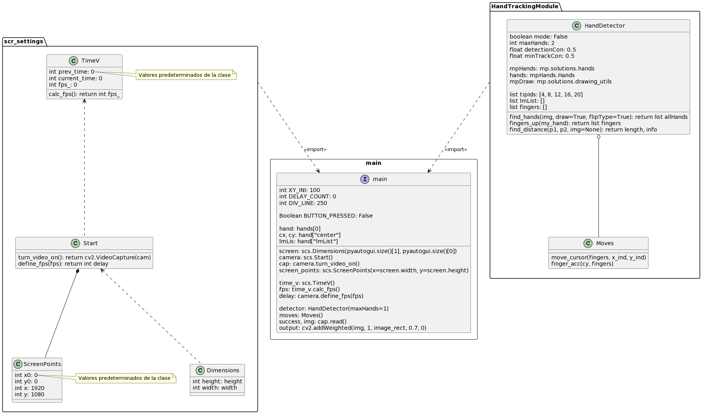
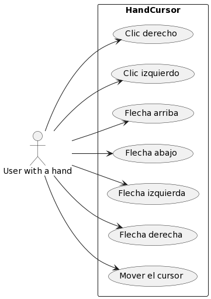

# Introduction

Technology advances and innovates with the intention of making our daily lives easier. For example, one day you have an important presentation and you already have the slides projected on the board, but you forgot the control that allows you to control the presentation remotely. Instead of approaching the PC every now and then to change the slide, you can open the virtual mouse software, which has the purpose of speeding up certain behaviors when using the computer, and at a certain level, replacing the physical mouse and integrating some of the keyboard's own functionalities to: move the slide forward or backward, move the cursor on the screen, click on the buttons, make annotations, etc. From a distance, since its usefulness consists in detecting human hand gestures and the one with the fuchsia or green fluorecent handle through the camera in real time to perform certain tasks. All of this, thanks to libraries and trained modules such as OpenCV, CVzone, MediaPipe and PyAutoGUI.

# Documentation

## [Open CV](https://opencv.org/about/)
OpenCV is an open source computer vision and machine learning software library. It was built to provide a common infrastructure for computer vision applications and to accelerate the use of machine perception in commercial products. As a BSD-licensed product, OpenCV makes it easy for companies to use and modify the code.

_It is used in our project mainly to open the camera, display it in a resized frame and access its functions, as well as to draw on it._

## [MediaPipe](https://google.github.io/mediapipe/solutions/hands)
MediaPipe has the ability to perceive the shape and movement of hands to enhance the user experience across a variety of domains and technology platforms. The program employs machine learning to infer 21 3D landmarks of a hand from a single frame. While current approaches rely primarily on powerful desktop environments for inference, this method achieves real-time performance on a computer or mobile, and even adapts to multiple hands.

###### 21 hand landmarks

## [CV Zone](https://www.computervision.zone/)
CVzone is a computer vision package that facilitates the execution of image processing and artificial intelligence functions. At its core it uses the OpenCV and Mediapipe libraries.

_It includes a module called HandTrackingModule.py, which we will modify to our advantage and implement to simplify the registration of gestures performed by the hand by means of an ordered list with values between 1 and 0._ [More Info ↓](https://github.com/Slrosales/Vrtual-Mouse#commands)

## [PyAutoGUI](https://pyautogui.readthedocs.io/en/latest/)
PyAutoGUI allows Python scripts to control the **mouse and keyboard** to automate interactions with other applications. The API is designed to be simple. PyAutoGUI runs on Windows, macOS and Linux, and runs on Python 2 and 3.

## UML Classes Diagram

## UML Use case

# Commands

In the following table, some gestures and the function they perform are shown. It should be noted that in the code, the fingers of a hand are stored in a list of 5 spaces, where:
- 1: Finger up
- 0: Finger down
- List positions are for:
  - 1st: Thumb
  - 2nd: Index finger
  - 3rd: Middle/heart
  - 4th: Ring finger
  - 5th: Little finger

List of Fingers|Max. Hands|Function|
|:----:|:----:|:----:|
[0,0,0,0,1]|1|Move the cursor|
[0,0,0,1,1]|1|Left click|
[0,0,1,1,1]|1|Right click|
[1,0,0,0,0]|1|Left arrow ←|
[1,1,0,0,0]|1|Right arrow →|
[1,1,1,0,0]|1|Up arrow ↑|
[0,1,1,0,0]|1|Down arrow ↓|

# Test
If you want to try it, you must install the following libraries in your PC:
`pip install mediapipe`
`pip install PyAutoGUI`

+ We recommend installing and use [PyCharm](https://www.jetbrains.com/es-es/pycharm/download/#section=windows) IDE for **Community**
+ To clone the repository, click on the green button and copy the link of the repository
+ Back in Pycharm, click on VCS 
+ Click on version control
+ Paste the link and choose the directory
+ Click on clone
+ The libraries to install will be underlined, when you click on them the install button will appear.
+ After installing the libraries, you can run the program.

